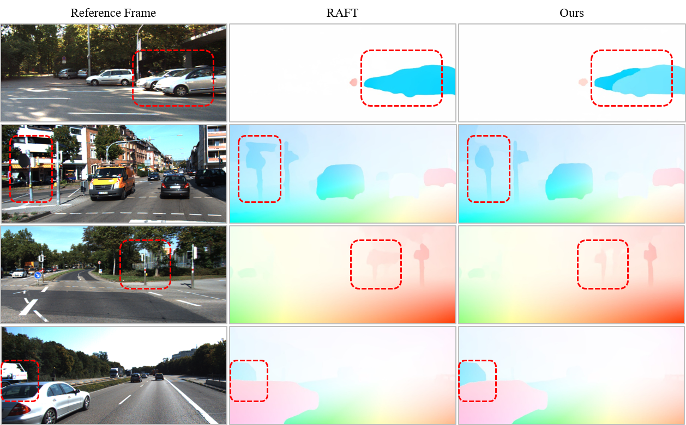

# CSFlow
The implementaions of CSFlow. 
We achieve state-of-the-art accuracy on KITTI-2015 flow benchmark.



# Install
```
python setup.py develop
```

# Devs
Hao Shi，YiFan Zhou

# Folder Hierarchy
\* local: you should create this folder in your local repository and these folders will not upload to remote repository.
```
├── data (local)            # Store test/training data
├── opticalflow             # All source code
|   ├─ api                  # Called by tools
|   ├─ core                 # Core code call by other directorys. Provide dataset, models ....
|   |   ├─ dataset          # I/O of each dataset
|   |   ├─ model            # Models, includeing all the modules that derive nn.module
|   |   ├─ util             # Utility functions
├── tools                   # Scripts for test and train
├── work_dirs (local)       # For developers to save thier own codes and assets
```

# The Code is coming soon.